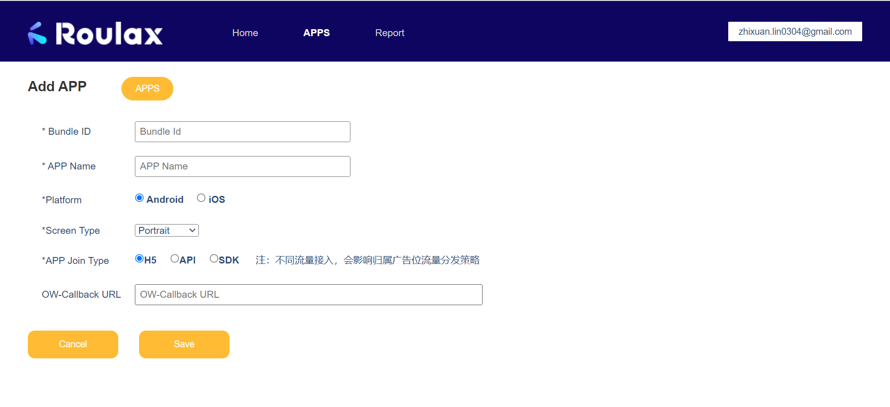

# **Offerwall iFrame 接入文档**

Roulax Offerwall 为想要在其应用程序/网站中包含Offerwall但可以控制优惠呈现的发布商提供了解决方案。所有与所提供的参数匹配的报价都将被返回并可以显示给用户。

## **获取你的接入链接**

1.创建你的应用，App Join Type并选择H5



2.创建你的Unit


3、创建完成，你可以获取到你的Offerwall集成链接


## JavaScript

```
window.open("https://wall.roulax.io/discovery?app_id={app_id}&unit_id={unit_id}&publisher_id={pulisher_id}&gaid={gaid}&userid={userid}")
```

## iFrame

```
<iframe src="https://wall.roulax.io/discovery?app_id={appid}&unit_id={unitid}&publisher_id={pulisher_id}&gaid={gaid}&userid={userid}"></iframe>
```

| Parameters   | Description                                                  | Format    |
| ------------ | ------------------------------------------------------------ | --------- |
| app_id       | 你的AppId，可从平台中获取。（从平台中获取的OW H5 Link已填写app_id） | mandatory |
| unit_id      | 你的UnitId，可从平台中获取。（从平台中获取的OW H5 Link已填写unit_id） | mandatory |
| publisher_id | 你的PublisherId，可从平台中获取。（从平台中获取的OW H5 Link已填写publisher_id） | mandatory |
| gaid         | 如果是Android用户，请填写GAID；如果是iOS用户，请填写IDFA     | mandatory |
| userid       | 唯一的用户ID                                                 | mandatory |