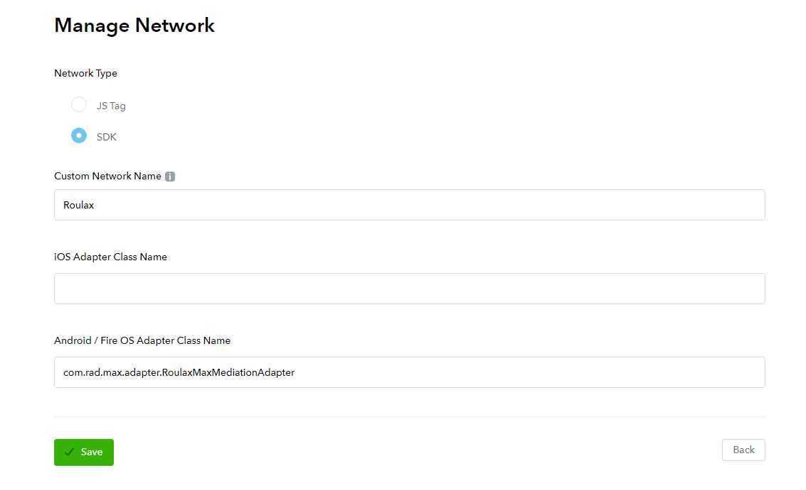
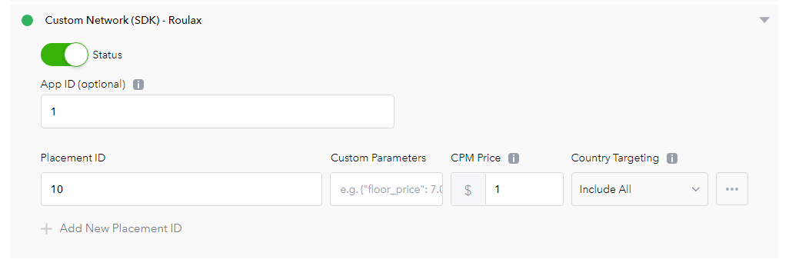

# Roulax接入MAX自定义network平台

[English Document](RSDK-MAX-English.md)

## 更新日志
| RoulaxSDK版本 | Adapter版本 |
|--|--|
| 1.0.11 | [Roulax-Max-Adapter](https://github.com/RoulaxTeam/Roulax-Android-SDK/releases/download/network_max/rad-adapter-max.aar)  |
| 2.0.00 | [Roulax-Max-Adapter](https://github.com/RoulaxTeam/Roulax-Android-SDK/releases/download/network_max/rad_adapter_max-2.0_release.aar) |

### 支持的广告类型

1. 激励视频
2. 插屏视频
3. Banner

### 支持的平台

1. 安卓

### 支持的AppLovin版本

11.3.3

## 在Max中添加自定义网络配置

### 1. 添加Network配置

在Max里选择 [MAX > Mediation > Manage > Networks](https://dash.applovin.com/o/mediation/networks/). 然后点击页面底部的**"Click here to add a Custom Network"**. 创建自定义network的页面出现之后，添加自定义network的参数:



- **Network Type**：选择 `SDK`.
- **Name**: 输入 `Roulax`
- **Android Adapter Class Name**:
- 输入 `com.rad.max.adapter.RoulaxMaxMediationAdapter`

### 2. 开启SDK自定义network

在MAX里打开 [MAX > Mediation > Manage > Ad Units](https://dash.applovin.com/o/mediation/ad_units/)，然后选择一个你希望添加自定义network的广告位：



- **App ID**：Roulax的App Id
- **Placement ID**： Roulax的Unit Id
- **Custom Pameters**：空
- **CPM Price**：Roulax的CPM价格

## 在Android中集成

### 1. 在Android中集成Max

参考文档: [MAX Integration](https://dash.applovin.com/documentation/mediation/android/getting-started/integration)

### 2. 添加库依赖

把Network Adapter的aar文件和RoulaxSDK的aar放入你项目中的`libs`文件夹下, 然后在`build.gradle`文件中加入以下代码:

```
repositories {  
     // ... other repositories
       flatDir {
	   dirs  'libs'
	}
}
```

```
dependencies {  
    // ... other project dependencies
    implementation (name: "rad_adapter_max-release", ext: "aar")
    implementation (name: "rsdk-release", ext: "aar")
}
```

