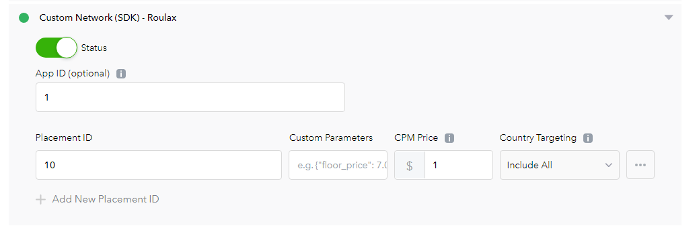

# Integrate Roulax by Max custom Networks

[中文文档](RSDK-MAX-Chinese.md)

## Update Note
| RoulaxSDK Version | Adapter Version | Log |
|--|--|--|
| 1.0.11 | [Roulax-Max-Adapter](https://github.com/RoulaxTeam/Roulax-Android-SDK/releases/download/network_max/rad-adapter-max.aar) | Support interstitial style|
| 2.0.00 | [Roulax-Max-Adapter](https://github.com/RoulaxTeam/Roulax-Android-SDK/releases/download/network_max/rad_adapter_max_2.0_release.aar) | Added support for rewarded video and Banner ad styles |

### Support ads

1. Interstitial
2. RewardVideo
3. Banner

### Support platforms

1. Android

### AppLovin version

11.3.3

## Add Custom Network configurations in Max Dashboard

### 1. Add Network configurations

In the MAX Dashboard, select [MAX > Mediation > Manage > Networks](https://dash.applovin.com/o/mediation/networks/). Then click **"Click here to add a Custom Network"** at the bottom of the page. The Create Custom Network page appears. Add the information about your custom network:


- **Network Type**：Select `SDK`.
- **Name**: Input `Roulax`
- **Android Adapter Class Name**:
- Input `com.rad.max.adapter.RoulaxMaxMediationAdapter`

### 2. Enable the Custom SDK Network

Open [MAX > Mediation > Manage > Ad Units](https://dash.applovin.com/o/mediation/ad_units/) in the MAX dashboard and select an ad unit for which you want to add the custom SDK network that you created in the previous step.



- **App ID**：App Id of Roulax
- **Placement ID**： Unit ID of Roulax
- **Custom Pameters**：Empty
- **CPM Price**：CPM price of Roulax

## Integrate in Android

### 1. Integrate MAX in Android

Reference: [MAX Integration](https://dash.applovin.com/documentation/mediation/android/getting-started/integration)

### 2. Add dependency libraries

Put the aar file of Roulax SDK to the `libs` folder of your project, then add the following to your `build.gradle` file.

```
repositories {  
     // ... other repositories
       flatDir {
	   dirs  'libs'
	}
}
```

```
dependencies {  
    // ... other project dependencies
    implementation (name: "rad-adapter-max", ext: "aar")
    implementation group: 'com.google.android.gms', name: 'play-services-ads', version: '15.0.0'
    implementation 'com.google.guava:guava:31.0.1-android'
    implementation 'androidx.media:media:1.4.3'
    implementation 'androidx.appcompat:appcompat:1.3.0'
    implementation 'com.google.android.material:material:1.4.0'
    implementation 'androidx.constraintlayout:constraintlayout:2.1.3'
}
```
