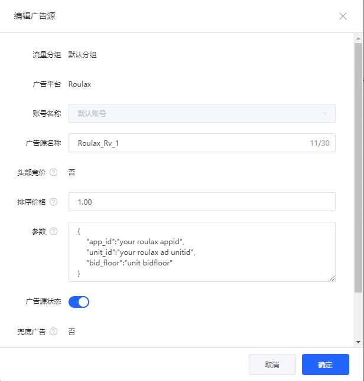

# TopOn 通过聚合方式集成 Roulax

## 其他语言
* en [English](english.md)
## 更新日志
| RoulaxSDK版本 | Adapter版本 | 日志 |
|--|--|--|
| 2.1.01 | [Roulax-Topon-Adapter](https://github.com/RoulaxTeam/Roulax-Android-SDK/releases/download/adapter_topon/rad_adapter_topon_2.1.01_release.aar) | 新增广告模板支持 |

### 支持的广告
1. 插屏广告
2. 横幅广告
3. 激励视频
4. 开屏广告
5. 原生广告

### 支持的平台
1. Android

### TopOn 版本
v5.6.4 及以上版本

## 在 TopOn 后台添加聚合配置

### 1. 添加Roulax广告平台
登录TopOn开发者后台，点击 [广告平台](https://app.toponad.com/m/network)，点击 **"+ 广告平台"**， 选择 **“自定义广告平台”**

1. 填写广告平台名称，例如“Roulax”
2. 在Adapter类名 > Android > Adapter中填入

  激励视频 **“com.rad.adapter.topon.RoulaxRewardVideoAdapter”**

  插屏 **“com.rad.adapter.topon.RoulaxInterstitialAdapter”**

  横幅 **“com.rad.adapter.topon.RoulaxBannerAdapter”**

  原生 **“com.rad.adapter.topon.RoulaxNativeAdapter”**

  开屏 **“com.rad.adapter.topon.RoulaxSplashAdapter”**

### 2. 添加Roulax广告平台的广告源
您可以在TopOn后台的**聚合管理**添加Roulax广告平台的**广告源**。

需要填写Roulax广告源参数，参数格式必须是以下json格式：
<pre>
{
    "app_id":"your roulax appid",
    "unit_id":"your roulax ad unitid",
    "bid_floor":"unit bidfloor"
}
</pre>

## Android集成配置

### 1. 在Android项目中集成TopOn
参考TopOn官方文档 [TopOn Integration](https://docs.toponad.com/#/en-us/android/GetStarted/TopOn_Get_Started)

### 2. 下载Roulax SDK

### 3. 下载[Roulax-Adapter-TopOn](https://github.com/RoulaxTeam/Roulax-Android-SDK/releases/download/adapter_topon/rad_adapter_topon_0.0.3-release.aar)

## 检查是否接入成功

正常接入成功后，请求插屏广告后，在 logcat 中过滤 `RSDK` 后会有以下的日志输出：
<pre>
D/RSDK: Roulax Network-TopOn-Interstitial init success
D/RSDK: on SDK-Core init success
</pre>
