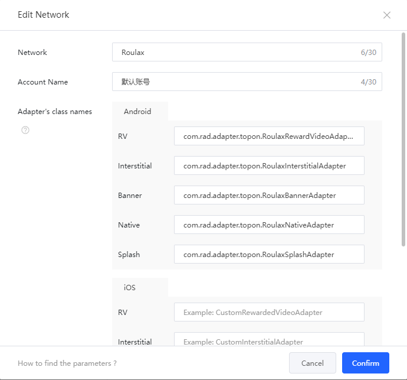
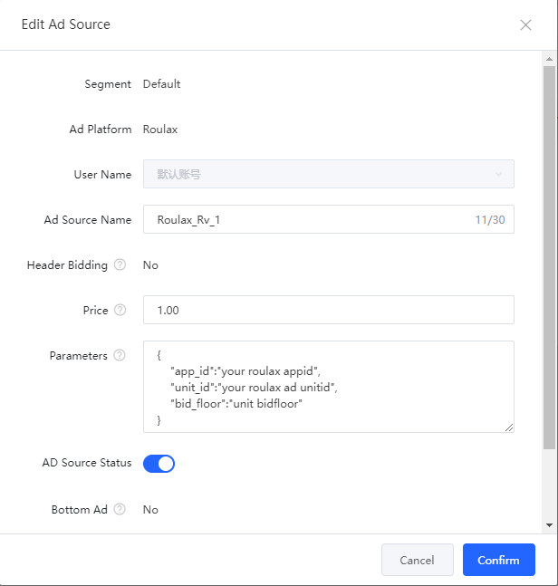

# Integrate Roulax by TopOn custom Networks

## Language
* ch [中文](chinese.md)

### Support ads
1. Interstitial

### Support platforms
1. Android

### TopOn version
v5.6.4 or latest

## Add Network configurations in TopOn Dashboard

### 1. Add Roulax SDK Network
In the TopOn dashboard, select [Network](https://app.toponad.com/m/network), click **"+ Network"**, select **“Custom Network”**

1. Fill in the Network Name, such as "Roulax"
2. Fill **“com.rad.adapter.topon.RoulaxInterstitialAdapter”** in the Adaper's Class Name > Android > Interstitial

### 2.Add the Ad Sources for Roulax Network
You can add the Ad Source of the **Roulax Network** on the **Mediation** pages of the TopOn, need to fill in the **Parameters**. 

The Parameters of the Ad Source must be the json format below:
<pre>
{
    "app_id": "your roulax appId",
    "app_key": "your roulax appKey",
    "inter_unit_id": "your roulax interstitial unitId"
}
</pre>

## Integrate in Android

### 1. Integrate TopOn in Android
Reference [TopOn Integration](https://docs.toponad.com/#/en-us/android/GetStarted/TopOn_Get_Started)

### 2. Download Roulax SDK

### 3. Download Roulax TopOn Network Adapter

## Check integrate successful

After integrate is successful，If request Interstitial ads, filter  `RSDK` in logcat will have logs like these:
<pre>
D/RSDK: Roulax Network-TopOn-Interstitial init success
D/RSDK: on SDK-Core init success
</pre>